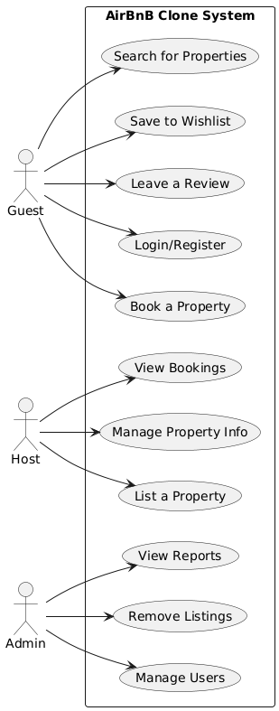

# Requirement Analysis in Software Development

## Introduction
- This repository explores the process of requirement analysis in software development.
- Requirement analysis is the critical first step in the software development life cycle (SDLC), focused on understanding what the software should do and the constraints it must operate within.
- It involves identifying, documenting, and analyzing user and business needs to ensure the final product meets expectations and avoids costly mistakes later in the project. 

## What is Requirement Analysis?
- Requirement Analysis is the systematic process of identifying, understanding, and documenting the needs and expectations of stakeholders for a software system or project.
- During requirement analysis, both functional and non-functional requirements are gathered through communication with stakeholders, including clients, users, and project managers.

### Importance of requirement analysis
- Minimize risks of miscommunication and costly changes later in the project.
- Bridge the gap between stakeholder expectations and technical implementation.
- Ensure the software meets quality, performance, and business goals.

### Key Activities in Requirement Analysis
- **Requirement Gathering**  
  Collecting initial information and needs from stakeholders through various sources such as interviews, surveys, and existing documentation.
- **Requirement Elicitation**  
  Engaging with stakeholders to uncover detailed requirements, clarify expectations, and resolve ambiguities using techniques like workshops, brainstorming, and prototyping.
- **Requirement Documentation**  
  Recording the gathered requirements in a clear, organized, and accessible format, such as requirement specifications, user stories, or use case diagrams.
- **Requirement Analysis and Modeling**  
  Analyzing the documented requirements to identify conflicts, redundancies, and feasibility. Creating models such as flowcharts or UML diagrams to visualize system behavior and structure.
- **Requirement Validation**  
  Reviewing and verifying the requirements with stakeholders to ensure accuracy, completeness, and agreement before moving forward in the development process.

## Types of Requirements
### Functional Requirements
Functional requirements define the core functions and features that the AirBnB Clone must perform.

Examples:
- Users can **search for rental properties** by location, date, and number of guests.
- Users can **create accounts, log in, and manage their profiles**.
- Hosts can **list properties**, including photos, descriptions, pricing, and availability.
- Users can **book a property** for specific dates and receive a booking confirmation.
- The system allows **users to post reviews and ratings** for properties.
- A **wishlist/favorite** feature lets users save properties for later viewing.
- The app provides **secure payment integration** for bookings.

### Non-functional Requirements
Non-functional requirements define how the system performs and behaves beyond its core functionality.

Examples:
- The system must be **accessible across devices** (mobile, tablet, desktop) with a responsive UI.
- All user and payment data must be **secure and encrypted**, following modern security standards.
- The platform should support **up to 50,000 concurrent users** during peak seasons.
- Pages should **load in under 2 seconds** to enhance user experience.
- The system must have **99.9% uptime** to ensure availability to users at all times.
- The UI should follow **consistent design patterns** for ease of navigation and usability.

## Use Case Diagrams
- Use Case Diagrams help in illustrating the interactions between users and the system, providing a clear understanding of system functionality.
- They are useful in requirement analysis and defining the scope of the system.

## Acceptance Criteria
- Acceptance Criteria define the conditions that a feature must meet to be considered complete and acceptable by the stakeholders. 
- They help in establishing clear expectations and ensure the feature functions as intended. Well-defined acceptance criteria improve communication, guide development, and ensure quality control.

### Example: Checkout Feature
- The guest must review a summary of their reservation before confirming checkout.
- The system must allow the guest to choose a payment method (e.g., credit card, PayPal).
- The system must validate payment details and notify the guest of any errors.
- The booking is confirmed only after successful payment.
- The guest receives a confirmation email with booking details once the checkout is complete.

